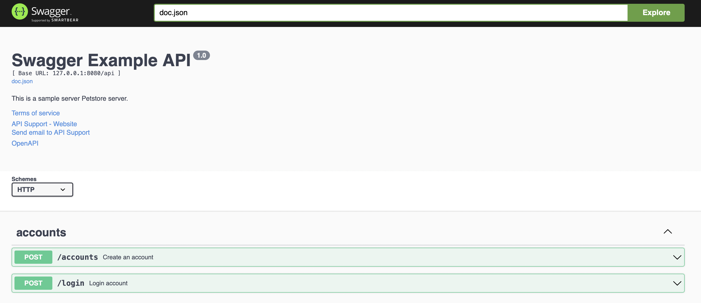

# User Guide

## Setup 
- Check [**Docker Compose Installation**](https://docs.docker.com/compose/install/) for more information about docker-compose installation.
- Verify the installation by running:
```
$ docker-compose --version
```
- If you encounter any permission issues with Docker, please refer to the [**Post-Installation Step**](https://docs.docker.com/engine/install/linux-postinstall/) to learn how to manage Docker as a non-root user.

## Build and Run API server with docker-compose
- Write the following code into the docker-compose.yaml file.
```
version: "3.9"
services:
  postgres:
    image: postgres:14-alpine
    environment:
      - POSTGRES_USER=root
      - POSTGRES_PASSWORD=root
      - POSTGRES_DB=senao
    ports:
      - "5432:5432"
    networks: 
      - senao-network
  api:
    image: amboseqiu/senao_hw
    ports:
      - "8080:8080"
    depends_on:
      - postgres
    command: [ "/app/main" ]
    networks: 
      - senao-network
networks:
  senao-network:
    name: senao-network
```

- To build the Docker Compose file, make sure you are in the same directory as the file.
```
$ docker-compose build
```

- Run the docker-compose 
```
$ docker-compose up -d
```
- The API server will make multiple attempts to connect to the PostgreSQL database in case of failure. Therefore, if you encounter an error message like the one below, there is no need to worry:  
```
root-api-1       | [error] failed to initialize database, got error failed to connect to `host=postgres user=root database=senao`: dial error (dial tcp 172.18.0.2:5432: connect: connection refused)
```
- Check docker to ensure that both the API server and PostgreSQL are running. If you see something similar to the following, it means everything is working well.
```
$ docker ps -a        
CONTAINER ID   IMAGE                COMMAND                  CREATED         STATUS         PORTS                    NAMES
5e53ef45e278   amboseqiu/senao_hw   "/app/main"              7 seconds ago   Up 5 seconds   0.0.0.0:8080->8080/tcp   senao_hw-api-1
b8f1d75b6685   postgres:14-alpine   "docker-entrypoint.s…"   7 seconds ago   Up 6 seconds   0.0.0.0:5432->5432/tcp   senao_hw-postgres-1
```

- Browse to [http://127.0.0.1:8080/swagger/index.html](http://127.0.0.1:8080/swagger/index.html). You will see Swagger 2.0 Api documents as shown below:

